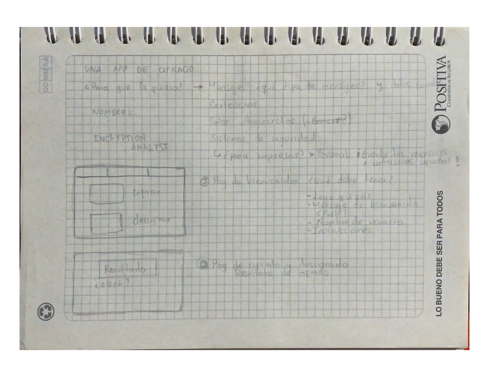

# Cifrado César

## Encryption Analyst

Somos una aplicación web diseñada con el objetivo de ayudar a las personas con mejorar la seguridad de su información. Encryption Analyst no ofrece sus servicios de cifrado con un solo proposito, sino que ofrecemos el servicio para las necesidades que las personas presenten, por lo que damos varios tipos de ejemplos en los que el usuario puede implementar el cifrado, ya sea desde hacer sus contraseñas de redes sociales, o de correos electronicos mucho más seguras y variadas, hasta encriptar mensajes con información confidencial o personal en caso de necesitar compartirla, e incluso el envío de mensajes entre parejas, familiares o amigos, poder hacerlo de una forma diferente, fácil, creativa y sin riesgo.

## ¿A quién va dirigido?

Manejamos un público objetivo amplio, que va principalmente de usarios entre los 20 años y los 45 años aproximadamente, tratando de cubirir sus necesidades en diferentes estancias, desde el estudio universitario o desde el ambito empresarial, manejo de información de proyectos confidenciales y contraseñas, etc. Pero, de igual manera nuestro objetivo no centraliza el uso de la aplicación web a este tipo de usuarios y necesidadaes especificas, pués nuestro sistema está diseñado para ser acogido por todo tipo de público, ya que, nuestra interfaz es de fácil entendimiento y uso.

## Proceso de dieseño

El primer paso fue definir sobre el uso y el tema que tendría la herramienta. Ya después de tener claro para que sería útil mi aplicacion web, empecé a realizar un prototipo de baja fidelidad, pensando en el estilo que debe tener la página, se realiza una búsqueda en internet de los posibles referentes a tomar para el proyecto. Finalmente, se escoge un modelo de 'traductores' y se procede a realizar el prototipo de baja fidelidad, con la idea principal de estructurar el contenido de la página:

Luego de realizar una estructura básica en el código HTML, diseñé un prototipo de alta fidelidad en la aplicacion Figma con el fin de organizar y diseñar la estructura de la página con los elementos, mensaje de bienvenida, botones, etc. Para de esta manera, tener en mente un aproximado mayor de como quisiera que se visualizara mi página y que podría utilizar para empezar darle forma desde CSS.

 * [Prototipo de alta fidelidad](https://www.figma.com/file/BY15XE3BXOcokerbW4a7zT/Untitled?node-id=0%3A1)

 * Se toma los colores y estilos de la referencia, ya que el azul simboliza seguridad y confianza, que es justamente lo que queremos transmitir.
 * Se busca instruir al usuario inicialmente para que entienda la dinámica del desplazamiento.
 * Se propone una distribución para el cifrado y descifrado en dos columnas.